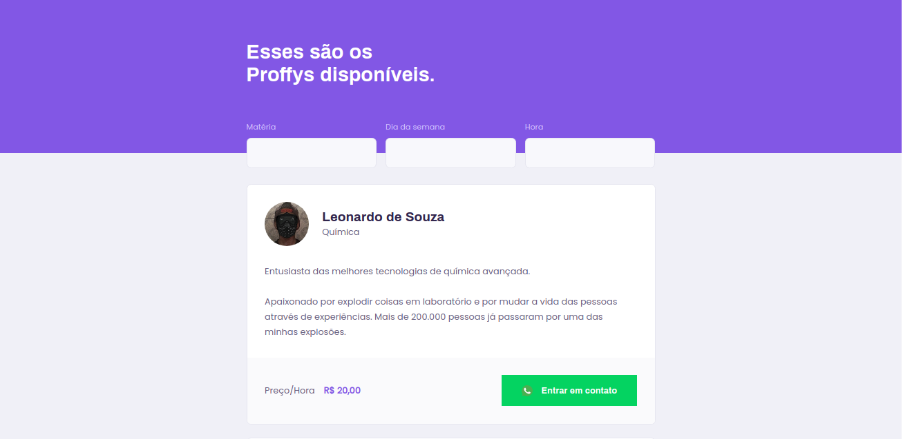

<h1 align="center">
    
</h1>

# O que é o Proffy?

<p>Proffy é uma aplicação web desenvolvida da Next Level Week ministrada pela empresa Rocketseat, a aplicação tem a finalidade de conectar alunos e professores que desejam buscar ou ensinar conhecimentos com uma variedade de disciplinas.</p>

## Tecnologias


<a href="https://nodejs.org" target="_blank"> </a>
<a href="https://reactjs.org/" target="_blank"> </a>
<a href="https://code.visualstudio.com" target="_blank"> </a>

## Layout da aplicação

<span>Tela inicial</span>


<span>Tela Estudar</span>


## Download

<p>Faça download através do comando abaixo</p>

```bash
 $ git clone https://github.com/Leonnardo21/proffy-nlw2
```

---

<p align="center">Iniciando projeto - Front-End e Back-End</p>

<h2> Web </h2>

```javascript
$ cd web/

//Instalando as dependências
$ yarn install

//Inicializando projeto
$ yarn start

```

<h2> Server </h2>

```javascript
$ cd server/

//Instalando as dependências
$ yarn install

//Inicializando projeto
$ yarn start
```

---

## Licença

Esse projeto está sob a licença MIT. Veja o arquivo [LICENSE](LICENSE.md) para mais detalhes.

---
